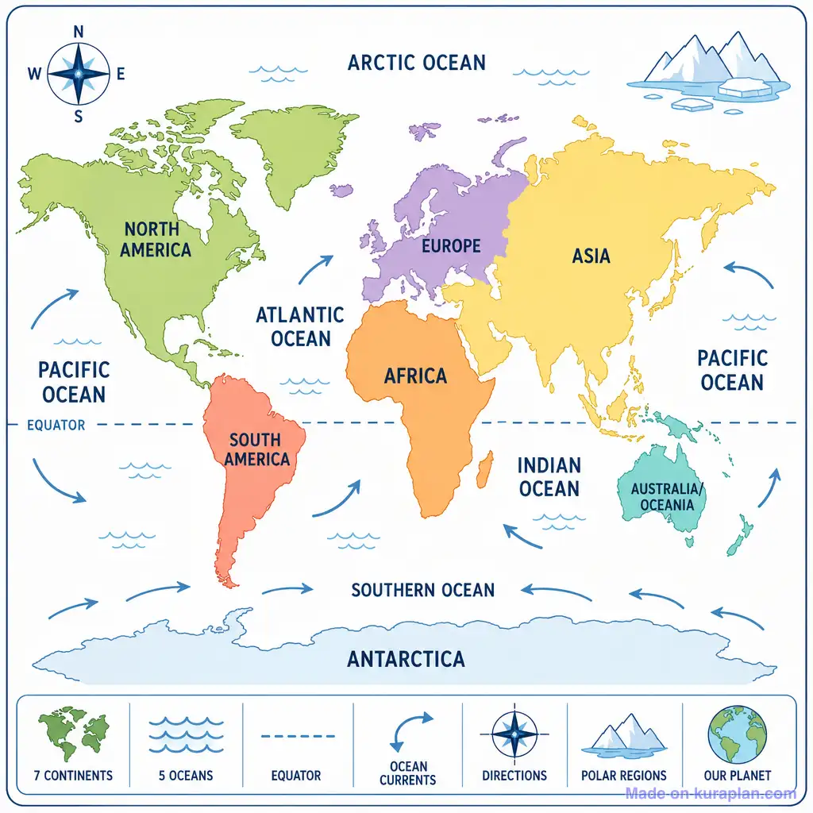
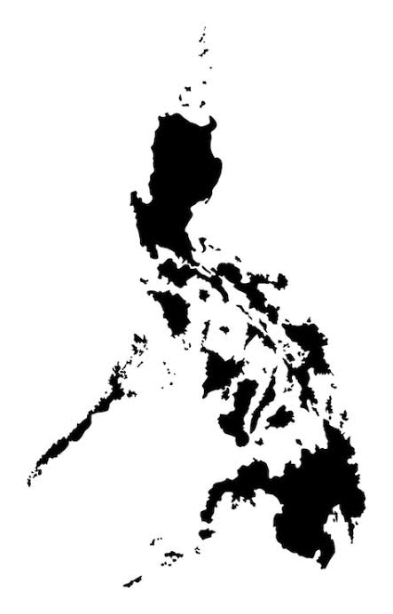
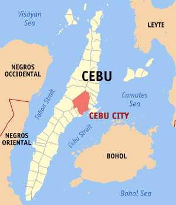

# Chavez.Activity2
<!DOCTYPE html>
<html lang="en">

<head>
  <title>Main Page</title>
</head>

<body>
<h1>Main Page</h1>
  
This page is dedicated for the user to browse through new different update logs throughout the world.

  

  <h2>Webpages:</h2>
  <a href="KimChi's%20The Whole World Update Log.html">The Whole World Update logs</a>
   
  
   
  <a href="KimChi's%20The Continent Update Log.html">Each Continent Updates logs</a>
   
  
   
  <a href="KimChi's%20Our Country Update Log.html">Our Country Update logs</a>
   
  
   
  <a href="KimChi's%20Cebu Update Log.html">Cebu Update logs</a>
   
  
</body>

</html>
